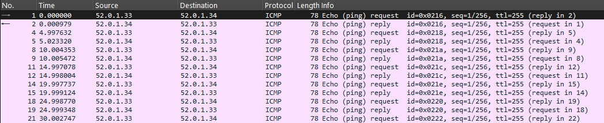

  ## PBR

### Цель:
Настроить политику маршрутизации в офисе Чокурдах;
Распределить трафик между 2 линками

### Описание домашнего задания:
В этой самостоятельной работе мы ожидаем, что вы самостоятельно:

1.Настроите политику маршрутизации для сетей офиса.
2.Распределите трафик между двумя линками с провайдером.
3.Настроите отслеживание линка через технологию IP SLA.(только для IPv4)
4.Настройте для офиса Лабытнанги маршрут по-умолчанию.
5.План работы и изменения зафиксированы в документации


## Выполнение

Начнем с самого простого – пункта 4.

#### Маршрут по умолчанию в Лабынтагах


Устанавливаем маршрут по умолчанию:
```
ip route 0.0.0.0 0.0.0.0 52.0.1.37
```

Наблюдаем появление статических маршрутов:


`S*    0.0.0.0/0 [1/0] via 52.0.1.37`


### Тренировка: использование access-list


Попробуем разрешить трафик с VPC30 и запретить с VPC31


Создаем **стандартный** access-list (про расширенный см. ниже):
```
R28(config)#access-list 1 permit host 10.2.0.30 log
R28(config)#access-list 1 deny host 10.2.1.31 log
```

Вешаем его на входящие пакеты интерфейса (`access-group`):
```
R28(config)#interface ethernet 0/2.300
R28(config-subif)#ip access-group 1 in

R28(config)#interface ethernet 0/2.301
R28(config-subif)#ip access-group 1 in

```

Проверяем:
```
R28#show access-lists
Standard IP access list 1
    10 permit 10.2.0.30
    20 deny   10.2.1.31
```
VPC30
```
VPCS> ping 10.2.0.28

84 bytes from 10.2.0.28 icmp_seq=1 ttl=255 time=5.092 ms
84 bytes from 10.2.0.28 icmp_seq=2 ttl=255 time=3.700 ms
```

VPC31
```
VPCS> ping 10.2.1.28

*10.2.1.28 icmp_seq=1 ttl=255 time=3.355 ms (ICMP type:3, code:13, Communication                         administratively prohibited)
*10.2.1.28 icmp_seq=2 ttl=255 time=5.839 ms (ICMP type:3, code:13, Communication                         administratively prohibited)
*10.2.1.28 icmp_seq=3 ttl=255 time=3.124 ms (ICMP type:3, code:13, Communication                         administratively prohibited)
```

### Policy Based Routing (PBR)

Далее настроим балансировку через PBR (при помощи `route-map` и `access-lists`).

Общая схема работы PBR:

1. Определяем `route-map <route-map-name> [permit | deny] [sequence-number]`
2. Определяем критерии отбора трафика через `match`
3. Определяем next-hop адрес `set next-hop <ip-address>`
4. Применяем на входящем интерфейсе – `ip policy route-map <route-map-name>` 
5. *Для применения к локальному трафику маршрутизатора `ip local policy <route-map-name>`

_Общая логика:_ берем входящие пакеты с Ethernet 0/2 смотрим на source адрес и в зависимости от source адреса выставляем next_hop.

В нашем случае это будет выглядеть следующим образом:

На R28 cоздаем `access-list`:
```
ip access-list extended VPC30
    permit ip host 10.2.0.30 any

ip access-list extended VPC31
    permit ip host 10.2.1.31 any
```
Помним, что в `route-map`, как и в `filter-list`, – запрет по умолчанию.

```
route-map RM-BALANCING permit 10
match ip address ACL-VPC30
set ip next-hop 52.0.1.29

route-map RM-BALANCING permit 20
match ip address ACL-VPC31
set ip next-hop 52.0.1.34
```


#### IP SLA

Будем запускать пинги раз в 5 секунд с маршрутизатора R28 на ip адреса интерфейсов R25 и R26 (настройки ниже).

На R28 выполняем следующие команды:
```
conf terminal

ip sla 1
 icmp-echo 52.0.1.29 source-ip 52.0.1.30
 frequency 5
exit
ip sla schedule 1 life forever start-time now

ip sla 2
 icmp-echo 52.0.1.34 source-ip 52.0.1.33
 frequency 5
exit
ip sla schedule 2 life forever start-time now
```

Проверка через wireshark:



Просмотр статистики:

```
R28#show ip sla statistics
IPSLAs Latest Operation Statistics

IPSLA operation id: 1
        Latest RTT: 2 milliseconds
Latest operation start time: 17:18:11 UTC Wed Nov 12 2025
Latest operation return code: OK
Number of successes: 287
Number of failures: 1
Operation time to live: Forever

IPSLA operation id: 2
        Latest RTT: 18 milliseconds
Latest operation start time: 17:18:09 UTC Wed Nov 12 2025
Latest operation return code: OK
Number of successes: 274
Number of failures: 1
Operation time to live: Forever
```

### Настройка мониторинга доступности провайдеров и автоматическое переключение

Выполнялось при помощи `track`:
```
!
route-map RM-BALANCING permit 10
 match ip address ACL-VPC30
 set ip next-hop verify-availability 52.0.1.29 10 track 1
 set ip next-hop verify-availability 52.0.1.34 track 2
 set ip next-hop 52.0.1.29
!
R28(config-subif)#ip policy route-map RM-BALANCING

route-map RC-BALANCING permit 10
 match ip address ACL-VPC31
 set ip next-hop verify-availability 52.0.1.34 10 track 1
 set ip next-hop verify-availability 52.0.1.29 20 track 2
 set ip next-hop 52.0.4.34
!
R28(config-subif)#ip policy route-map RC-BALANCING
```
```
!
track 1 ip sla 1 reachability
!
track 2 ip sla 2 reachability
!
```

### Проверка

Для проверки пришлось настроить статические маршруты на маршрутизаторах R25, R26, R27. (Не забываем прописать обратные маршруты).

<details>
<summary> static routes </summary>

R25
```
ip route 5.0.0.0 255.255.255.0 52.0.1.33 name test_track_chokurdah
ip route 5.0.0.0 255.255.255.0 10.0.2.26 150 name to_triada_less_priority
ip route 40.0.0.27 255.255.255.255 52.0.1.38 name to_labintagi
```
R26
```
ip route 5.0.0.0 255.255.255.0 52.0.1.30 name to_chokurdah
ip route 40.0.0.27 255.255.255.255 10.0.2.25 name to_labintagi
```

R28
```
ip route 40.0.0.27 255.255.255.255 52.0.1.29 name to_labintagi
ip route 40.0.0.27 255.255.255.255 52.0.1.34 name to_labintagi
```

</details>

**До обрыва линка**  
Посмотрим маршрут с VPC30:
```
VPCS> trace 40.0.0.27 -P 1
trace to 40.0.0.27, 8 hops max (ICMP), press Ctrl+C to stop
 1   10.2.0.28   2.989 ms  4.722 ms  3.983 ms
 2   52.0.1.29   3.888 ms  5.317 ms  6.014 ms
 3   10.0.2.25   4.331 ms  3.972 ms  4.223 ms
 4   40.0.0.27   5.477 ms  6.468 ms  7.766 ms
```
и с VPC31:
```
VPCS> trace 40.0.0.27 -P 1
trace to 40.0.0.27, 8 hops max (ICMP), press Ctrl+C to stop
 1   10.2.1.28   2.791 ms  2.551 ms  2.424 ms
 2   52.0.1.34   4.185 ms  4.187 ms  4.813 ms
 3   40.0.0.27   5.266 ms  4.646 ms  4.969 ms

```

Маршруты идут разными путями, балансировка работает.


Гасим `eth0/1` на R26:
```
R26(config-if)#shutdown
```

Проверяем, что доступность все равно есть и изменился маршрут с VPC30:
```

VPCS> trace 40.0.0.27 -P 1
trace to 40.0.0.27, 8 hops max (ICMP), press Ctrl+C to stop
 1   10.2.0.28   3.317 ms  3.290 ms  2.272 ms
 2   52.0.1.34   29.205 ms  4.288 ms  4.727 ms
 3   40.0.0.27   5.924 ms  10.448 ms  5.073 ms
```

Поднимаем `eth0/1` на R25 обратно, наблюдаем небольшую задержку и перестроение.

```
VPCS> trace 40.0.0.27 -P 1
trace to 40.0.0.27, 8 hops max (ICMP), press Ctrl+C to stop
 1   10.2.0.28   3.347 ms  2.519 ms  2.697 ms
 2   52.0.1.29   3.548 ms  3.844 ms  3.541 ms
 3   10.0.2.25   4.073 ms  5.971 ms  4.848 ms
 4   40.0.0.27   12.918 ms  7.665 ms  29.911 ms

```

Балансировка и автоматическое перестроение маршрутов – работают.
</details>
